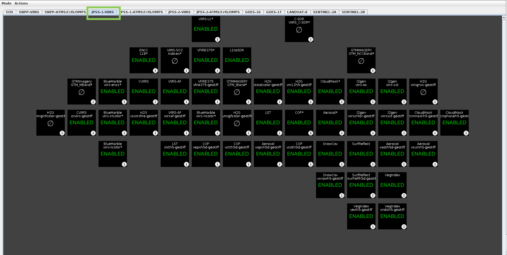

# Automated Earth observation using AWS Ground Station S3 Data Delivery

## Introduction

In this guide we'll be using the [AWS Ground Station feature that sends downlinked satellite data directly to an S3 bucket](https://docs.aws.amazon.com/ground-station/latest/ug/how-ground-station-works.html) to create an automated Earth Observation pipeline. This simplifies data downlinking because you do not need to run your own EC2 receiver instance during contact, but can instead access the data asynchronously from an S3 bucket. Additionally the pipeline automations means that you no longer have to start and stop processing instances manually. After scheduling a contact everything is handle automatically and you get a notification when the processed data is available. 

We will create an automated EO pipeline that receives and processes data from the [NOAA-20 (JPSS-1) satellite](https://directreadout.sci.gsfc.nasa.gov/?id=dspContent&cid=246). NOAA-20 was launched in 2017 and is part of the United States National Oceanic and Atmospheric Administration's (NOAA) latest generation of U.S. polar-orbiting, non-geosynchronous, environmental satellites called the Joint Polar Satellite System (JPSS). It orbits the Earth in a Sun-synchronous near-polar orbit at an altitude of 825km, which makes it a LEO (Low Earth Orbit) satellite. NOAA-20 has five active sensing instruments. These are a substantial upgrade over the previous generation of instruments on board the AQUA and TERRA spacecraft. Using these new instruments the craft can provide greater-detailed observations that can make better predictions and highlight climate behavior in cases like El Niño and La Niña. We will be analyzing data from the Visible Infrared Imaging Radiometer Suite (VIIRS) onboard the craft. 

NOAA-20 broadcasts CCSDS-compliant CADU (Channel Access Data Unit) data frames. These are downlinked, demodulated, decoded and stored in VITA 49 in your S3 bucket by the new Amazon S3 data delivery feature of AWS Ground Station. The payload is then extracted from the .pcap files and stored as raw data in your S3 bucket. The CADUs are processed into Level 0 data products using NASA’s RT-STPS (Real-Time Software Telemetry Processing System). Level 0 data is then pushed to S3. IPOPP (International Planetary Observation Processing Package), also provided by NASA, is used to process Level 0 data into higher-level products. For example, Level 1 HDF files and Level 2 HDF files and TIFF images. IPOPP is installed and configured on the processor Amazon EC2 instance, which then pushes the Level 1 and Level 2 data products to S3. Once in S3, data products can be published to data subscribers or retrieved by other AWS services, such as Amazon SageMaker, for near real-time processing.

## High-level solution architecture


The solution operates as follows:

1. During a Satellite contact the AWS Ground Station S3 data delivery services deposits the downlink data as VITA 49 in .pcap files in an S3 bucket. 
2. When all .pcap files have been written a CloudWatch event is generated. 
3. The CloudWatch event triggers a Lambda function. 
4. The Lambda function strips out the payload data from the .pcap files into .bin raw data files. Then starts the RT-STPS processor EC2 instance. 
5. The EC2 instance combines the raw data into a single file, which it then processes into level 0 data using RT-STPS.
6. The EC2 instance pushes the data to S3, sends an SNS notification, then shuts down.
7. The SNS Notification triggers a Lambda function which starts up the Processor EC2 instance.
8. The Processor EC2 Instance pulls the data from S3, the processes it using IPOPP. Takes about 80 minutes.
9. The Processor EC2 Instance pushes the Level 1A, Level 1B and Level 2 data it produces to S3.
10. The Processor EC2 Instance sends an SNS notification, then shuts down.

To summarize, by scheduling a satellite contact in AWS GroundStation, steps 1-10 are automatically completed, which result in the data being made available via the S3 bucket.
If you subscribe to the SNS notifications, you will also receive emails with the output of the processing jobs.

# Earth Observation Science Data Levels

Earth Observation data products are most commonly described using levels 0-4 provided by NASA.
The levels are summarized below. For more information click [here](https://science.nasa.gov/earth-science/earth-science-data/data-processing-levels-for-eosdis-data-products).

- Level 0: Raw data from sensors with communications artifacts removed
- Level 1: Georeferenced and adjusted for known sources of error or interference
- Level 2: Specific data-rich products such as sea surface temperature data, or visible light data
- Level 3: Data mapped onto uniform space-time grid scales
- Level 4: Model output or results from deeper analysis of lower-level data, often using data from multiple measurements

# Prerequisites


##  AWS CLI Configured

[Install the latest AWS CLI](https://docs.aws.amazon.com/cli/latest/userguide/cli-chap-getting-started.html) and [configure it](https://docs.aws.amazon.com/cli/latest/userguide/cli-configure-quickstart.html#cli-configure-quickstart-config) with an IAM User role with privileges to the AWS Account you want to use.
If in doubt, use admin for testing, but create a Least Privileged Access (LPA) IAM user/role for any other environments.

##  Ground Station setup in your AWS Account

Send an email to aws-groundstation@amazon.com with the following details:
- Satellite NORAD ID: 43013 (JPSS1)
- You AWS Account Id
- AWS Regions you want use the Ground Station Service
- AWS Regions you want to downlink the data to, normally the same as above

##	A VPC with public subnets, plus an SSH key for accessing EC2 instance(s)

Make sure at minimum you have one SSH key and one VPC with an attached IGW and one public subnet. 
You can use the default VPC provided in the region. Follow [these instructions](https://docs.aws.amazon.com/AWSEC2/latest/UserGuide/ec2-key-pairs.html#having-ec2-create-your-key-pair) to create an EC2 SSH key in the region that you will be deploying your EC2 resources. 

##  Create working directory

### Linux / Mac

```bash
export WORKING_DIR='/Users/User/Downloads/jpss-test'
mkdir -p $WORKING_DIR
cd $WORKING_DIR
```

### Windows

```bash
set WORKING_DIR=\Users\User\Downloads\jpss-test
mkdir %WORKING_DIR%
cd %WORKING_DIR%
```

## Clone this repo
Install Git by following [these instructions](https://github.com/git-guides/install-git).

```bash
git clone https://github.com/aws-samples/aws-groundstation-s3-data-delivery.git
```

Alternatively, you can download this GitHub repository by clicking Code -> Download ZIP at the top of this page. 

# S3 Data Delivery and RT-STPS Instance


Follow the steps below to configure AWS Ground Station to downlink raw data from the JPSS1 Satellite directly into S3 and create level 0 products from it. 
The AWS Ground Station S3 Data Delivery services places VITA 49 encapsulated data from a JPSS1 contact into an S3 bucket. The EC2 instances processes it using NASA's RealTime Satellite Telemetry Processing Software (RT-SPTS) and uploads the data to S3.
Once the data is uploaded and SNS Notification is sent which triggers the IPOPP Processing node which creates the usable data products.

##	Create a Software S3 bucket

Setup some variables, then create the new Software S3 bucket.
Create this in the region you are downlinking to.

Edit the REGION and S3_BUCKET variables below, then execute the code.

### Linux / Mac

```bash
export REGION=your-aws-region
export S3_BUCKET=your-software-bucket-name

# Create the new S3 bucket if not already created

aws s3 mb s3://${S3_BUCKET} --region $REGION
```

### Windows

```bash
set REGION=your-aws-region
set S3_BUCKET=your-software-bucket-name

aws s3 mb s3://%S3_BUCKET% --region %REGION%
```

## Copy the lambda code and RT-STPS orchestration script to the software bucket 

The lambda.zip and rt-stps-process.sh are found in this repository.

### Linux / Mac

```bash
aws s3 cp $WORKING_DIR/aws-groundstation-s3-data-delivery/rt-stps/lambda.zip s3://${S3_BUCKET}/software/RT-STPS/lambda.zip --region $REGION 
aws s3 cp $WORKING_DIR/aws-groundstation-s3-data-delivery/rt-stps/rt-stps-process.sh s3://${S3_BUCKET}/software/RT-STPS/rt-stps-process.sh --region $REGION 
```

### Windows

```bash
aws s3 cp %WORKING_DIR%\aws-groundstation-s3-data-delivery\rt-stps/lambda.zip s3://%S3_BUCKET%/software/RT-STPS/lambda.zip --region %REGION%
aws s3 cp %WORKING_DIR%\aws-groundstation-s3-data-delivery\rt-stps/rt-stps-process.sh s3://%S3_BUCKET%/software/RT-STPS/rt-stps-process.sh --region %REGION%  
```

## Create the CloudFormation Stack for S3 Data Delivery and the RT-STPS instance

Create a CFN stack using the template: jpss1-gs-to-s3.yml. [Learn how to create a CFN stack](https://docs.aws.amazon.com/AWSCloudFormation/latest/UserGuide/cfn-console-create-stack.html). On the [stack creation console](https://console.aws.amazon.com/cloudformation) click Create Stack -> With New Resource. Then select the "Template is ready" radio button and "Upload a template file" radio button. Upload the jpss1-gs-to-s3.yml file here. Do not edit the jpss1-gs-to-s3.yml file manually!

Enter parameters as follows in the CloudFormation console:

**Important Note:** The IP address or range you enter into the SSHCidrBlock parameter will have access to both SSH on port 22 and the web-based Data Defender software on port 80. Adding large address ranges such as 0.0.0.0/0 will allow any IP address to access the ports and should not be done.

- Stack name: 'any value' e.g. gs-s3dd-jpss1
- SatelliteName: JPSS1
- GroundStationS3DataDeliveryBucketName: 'aws-groundstation-your-data-bucket'. The name must be globally unique and start with 'aws-groundstation-'
- SoftwareS3Bucket: 'your-software-bucket' The one you created in the previous steps
- SubnetId: 'a public subnet'
- VpcId: 'the VPC containing the above public subnet'
- SSHCidrBlock: 'your-public-ip'/32. If needed get it from https://whatismyip.com. Ensure you add “/32” to the end of the IP address
- SSHKeyName: 'your-ssh-key-name'
- NotificationEmail: 'your-email-address'


##  Subscribe to the SNS topic

During the creation of the CloudFormation stack an SNS topic is created.
To receive email messages you must subscribe to the topic by clicking the link sent to the email address specified when creating the stack.

##  Watch the progress

Once the EC2 instance is created the required software is installed and configured.
You can watch this progress by connecting to the instance over an SSH connection then run the following commands:

SSH Connection:
```bash
ssh -i <path-to-ssh-key-file> ec2-user@<instance-public-ip>
```

Check the user-data logfile:
```bash
tail -F /var/log/user-data.log
```

**Note:** For this solution to work correctly, the EC2 instance must be shutdown a few minutes before the contact. 

##  Summary

You now have the following created in your AWS Account:

- A Ground Station Mission Profile configured for the JPSS1 Satellite
- A Ground Station Demodulation and Decode configuration for the JPSS1 Satellite, compatible with the downstream processing software RT-STPS
- A Ground Station S3 Recording Config that delivers VITA 49 encapsulated data directly into an S3 bucket
- GroundStation CloudWatch events
- A Lambda function that strips out the payload from the encapsulated data and calls the RT-STPS processor instance
- An IAM Role attached to the Lambda function with permission to connect to the data delivery bucket
- A RT-STPS processor EC2 instance that creates level 0 data files from the raw instrument data. 
- An IAM Role and Instance Profile, attached to the EC2 instance with permission to connect to the software and data delivery buckets
- An SNS Topic to notify data capture completion


#	Processor Instance Creation - IPOPP
--- 

Follow these steps to create the IPOPP instance which ingests the level 0 data produced by the RT-STPS node to create usable level 2 earth observation data products.

```bash
export REGION=your-aws-region
export S3_BUCKET=your-software-bucket
```

### Windows

```bash
set REGION=your-aws-region
set S3_BUCKET=your-software-bucket
```

##  Copy the IPOPP files to the software S3 bucket
The IPOPP scripts (ipopp-ingest.sh, install-ipopp.sh) are found in this repository. 

### Linux / Mac

```bash
aws s3 cp $WORKING_DIR/aws-groundstation-s3-data-delivery/ipopp/ipopp-ingest.sh s3://${S3_BUCKET}/software/IPOPP/ipopp-ingest.sh --region $REGION 
aws s3 cp $WORKING_DIR/aws-groundstation-s3-data-delivery/ipopp/install-ipopp.sh s3://${S3_BUCKET}/software/IPOPP/install-ipopp.sh --region $REGION 
```

### Windows

```bash
aws s3 cp %WORKING_DIR%\aws-groundstation-s3-data-delivery\ipopp\ipopp-ingest.sh s3://%S3_BUCKET%/software/IPOPP/ipopp-ingest.sh --region %REGION% 
aws s3 cp %WORKING_DIR%\aws-groundstation-s3-data-delivery\ipopp\install-ipopp.sh s3://%S3_BUCKET%/software/IPOPP/install-ipopp.sh --region %REGION% 
```

##  Create the IPOPP Instance CloudFormation Stack

Create a CFN stack using the template the ipopp-instance.yml template.

- Stack name: 'any value' e.g. gs-processor-jpss1
- SatelliteName: JPSS1
- ReceiverCloudFormationStackName: 'The name of the CloudFormation Stack that created the receiver configuration'
- DataS3Bucket: 'your-data-delivery-bucket' (Data delivery bucket created in receiver stack)
- SoftwareS3Bucket: 'your-software-bucket-name' (Where you uploaded the software)
- InstanceType: c5.xlarge is OK for most IPOPP Software Processing Algorithms (SPAs). However, you will need m5.4xlarge to use the Blue Marble MODIS Sharpened Natural/True color SPAs.
- IpoppPassword: 'Enter a password to use for the ipopp user account and VNC password on the EC2 instance'
- SubnetId: 'A Public Subnet'
- VpcId: 'Select the VPC containing the above public subnet'
- SSHCidrBlock: 'your-public-ip'/32. If needed get it from https://whatismyip.com. Ensure you add “/32” to the end of the IP address
- SSHKeyName: 'your-ssh-key-name'
- NotificationEmail: 'Email address to receive processing updates'


##  Subscribe to the SNS topic

During the creation of the CloudFormation stack an SNS topic is created.
To receive email messages you must subscribe to the topic by clicking the link sent to the email address specified when creating the stack.

##  Watch the progress  

The initial part of the EC2 instance set up is automatic. After it has finished you will be prompted to manually complete the set up by following the steps in the next section Processor Instance Configuration - IPOPP. You can follow the progress of the automatic part over SSH by running the following commands. This takes about 10 minutes to complete. 

SSH Connection:
```bash
ssh -i <path-to-ssh-key-file> ubuntu@<instance-public-ip>
```

Check the user-data logfile:
```bash
tail -F /var/log/user-data.log
```

##  Summary

You now have the following created in your AWS Account:

- An EC2 Instance running Ubuntu 20 and the IPOPP software
- An SNS topic to notify processing completion
- A Lambda function to auto-start the IPOPP instance, triggered by the receiver SNS Topic

#	Processor Instance Configuration - IPOPP

These last steps in the configuration of the IPOPP processor instance must be completed manually.  


## Prerequisites

Download and install the Tiger VNC Client from [here](https://sourceforge.net/projects/tigervnc/files/stable/1.12.0/).
Or use the following quick-links for [Linux](https://sourceforge.net/projects/tigervnc/files/stable/1.12.0/tigervnc-1.12.0.x86_64.tar.gz/download),
[Mac](https://sourceforge.net/projects/tigervnc/files/stable/1.12.0/TigerVNC-1.12.0.dmg/download)
and [64 bit Windows](https://sourceforge.net/projects/tigervnc/files/stable/1.12.0/vncviewer64-1.12.0.exe/download).

## VNC Setup - Linux / Mac

1.	Run the command below to connect to the EC2 instance using SSH and tunnel the VNC traffic over the SSH session.

    ```bash
    ssh -L 5901:localhost:5901 -i <path to pem file> ubuntu@<public ip address of EC2 instance>
    ```

2.	Open the Tiger VNC Client application on your PC and connect to ‘localhost:1’
3.	When prompted, enter the ipopp password you provided to the CloudFormation template in the earlier step


##	VNC Setup - Windows

1.	Download the open source ssh client Putty from [here](https://www.chiark.greenend.org.uk/~sgtatham/putty/latest.html)
2.	Open Putty and enter the public IP of the EC2 instance in the Session->Host Name (or IP Address) field.
3.	Enter 'ubuntu' in Connection->Data-> Auto-login username
4.	In Connection->SSH->Auth, browse to the correct PPK key file (private SSH key) for the EC2 instance
5.	In Connection->SSH->Tunnels, enter 5901 in Source port, enter localhost:5901 in Destination, click Add
6.	Click Session, enter a friendly name in Save Sessions, then click Save
7.	Click Open to open the tunneled SSH session
8.	Open the Tiger VNC Client application on your PC and connect to ‘localhost:1’
9.	When prompted, enter the ipopp password you provided to the CloudFormation template in the earlier step

**Note:** If the Tiger VNC client cannot connect, or you see only a blank screen you may need to restart the vncserver process on the instance. To do this run the commands below in the SSH session to start the vnc server as the ipopp user:

```bash
su -l ipopp
sudo systemctl stop vncserver.service
sudo systemctl start vncserver.service
```


##  IPOPP SPA Configuration

IPOPP can create a large number of data sets and images from the level 0 data produced by RT-STPS. Among these are true color RGB images of the Earth's surface. These images are Level 2 products and to get them we must enable a subset of IPOPP Software Processing Algorithms (SPAs).
Unfortunately, SPAs can only be configured using a GUI java application.
Follow the steps below to connect to the server using a VPC client, then configure the required SPAs.

Perform the following steps within the VNC session.

1. Open a terminal and run the ipopp dashboard:

    ```bash
    ~/drl/tools/dashboard.sh &
    ```

2.	In the dashboard, click Mode->IPOPP Configuration Editor
3.	Click Actions->Configure Projection, Select Stereographic, then Click Configure Projection
4.	Select the JPSS-1-VIIRS tab as shown with a green box in the image below. Then enable the same SPA modules as in the image by clicking on them. This will enable all SPAs for the VIIRS instrument and allow you to see the full range of data products. 
5.  Select the JPSS-1-ATMS/CrIS/OMPS tab and disable all the SPAs. This will improve the processing time of the VIIRS SPAs. 
6.	Once you have finished configuring SPAs, click Actions->Save IPOPP Configuration
7.  Once this configuration process is done it does not need to be done again. IPOPP will now automatically start the the SPAs each time an ingest is done.



We encourage you to experiment with the different SPAs. Be mindful of their upstream and downstream dependencies. For an SPA to work as expected the upstream SPAs must also be enabled. When you mouse over an SPA it will highlight its upstream dependencies in yellow on the above rows.

You can monitor the progress of the SPAs during processing. After the IPOPP instance has started and the ingest process has begun you log into the IPOPP instance via VNC and start the dashboard as outlined above. Navigate to the JPSS-1-VIIRS tab and watch the progress. Once the SPAs have run the results can be found in $HOME/drl/data/pub/gsfcdata/jpss/viirs/level2


# Stop the EC2 instances

The EC2 instances are automatically started and stopped as required. To allow this to happen you must now stop all EC2 instances.

# Scheduling a Satellite Contact

At this point you can schedule a contact with JPSS1 using the AWS console.

##  Scheduling a live JPSS1 contact

Open up the GroundStation console and schedule a contact as required. Ensure you select the correct mission profile and satellite.
The entire process will be triggered by the Ground Station S3 Data Delivery CloudWatch event as described in the Solution overview section.


# Viewing the files created

When you captured data from a live satellite both instances will automatically shut down when they are finished processing.
You will find an email in your inbox with a summary from each node.

You can find the created files in the S3 Data bucket as follows:

- Level 0,1,2 Data Products: s3://${S3_DATA_BUCKET}/data/JPSS1/viirs/
- Logfiles: s3://${S3_DATA_BUCKET}/data/JPSS1/logs
- Raw data for re-processing: s3://${S3_DATA_BUCKET}/data/JPSS1/raw

In s3://${S3_DATA_BUCKET}/data/JPSS1/viirs/level2 images are stored in the .tif format. If you've followed SPA selection above, you will find the following images:

- Files ending in SHARPTCOLOR.tif -> beautiful RGB images of the Earth
- Files ending in LST.tif -> surface temperature images 
- Files ending in TCOLORFIRE.tif -> RGF images of the Earth with circles around ongoing fires. Red circles indicate high probability of fire. 


Cropped Active Fire (AF) locations image showing the south of France and Iberian peninsula, produced using IPOPP's VIIRS-AF SPA. The red circles indicate active fire areas of high confidence.


Cropped Land Surface Temperature (LST) image showing the north of Italy and the Alps, produced using IPOPP's LST SPA. The warmer colors indicate higher absolute temperature in Kelvin on a warm March day.

## Summary 
With this guide you asynchronously downlink data to an S3 bucket, without the need of spinning up a receiver EC2 instance. Here we downlinked data from the JPSS-1 craft and automatically processed it using RT-STPS and IPOPP. The automated pipeline can be applied to data from any spacecraft. 


# Known Errors


1. To detect and copy created data products to the S3 bucket, ipopp-ingest.sh simply calls "aws s3 sync" in a loop. Sometimes this command detects a file and tries to copy it when it is still being written to by the IPOPP process. This causes the s3 sync command to return a non-zero return code.

2. Occasionally the vncserver process does not start correctly, or sometime provides blank screen when you connect. To workaround this issue just kill and restart the vncserver process:

    ```bash
    su -l ipopp
    sudo systemctl stop vncserver.service
    sudo systemctl start vncserver.service
    ```

3. Sometimes when forwarding ports over ssh the tool that you are using might try to use IPV6 by default, which will result in a "bind: Cannot assign requested address". You can force it to use IPv4 with the "-4" flag. 

    ```bash
    ssh -4 -L 5901:localhost:5901 -i <path to pem file> ubuntu@<public ip address of EC2 instance>
    ```

4. This is more of an FYI than an error. The RT-STPS processor instance will auto-shutdown if it does not find a file to process. If you want to stop the auto-shutdown then add a tag to the instance with both key and value equal to "NoShutdown"

5. This is more of an FYI than an error. IPOPP will limit the products it produces if it is dark during the satellite contact. So if you don't see the product you need this may be the reason. For deeper troubleshooting you will need to get low-down and dirty in IPOPP and SPA error tracking - this is a bit messy and probably warrants it's own separate document!
